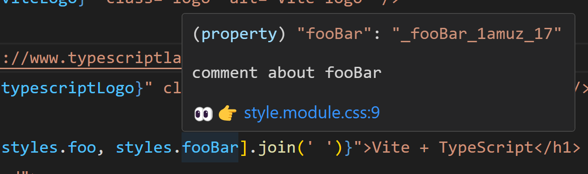

## vite-plugin-css-module-dts

A Vite plugin that automatically generates TypeScript type declaration files for CSS Modules.

### Install

```sh
npm install vite-plugin-css-module-dts -D
```

## Usage

#### vite.config.ts

```ts
import { defineConfig } from 'vite'
import cssModuleDtsPlugin from 'vite-plugin-css-module-dts'

const config = defineConfig({
  css: {
    // Enabling `devSourcemap` can display the source file path and support jumping to the corresponding line.
    devSourcemap: true,
  },
  plugins: [
    cssModuleDtsPlugin({
      // The directory for outputting dts files, by default it is located at css-module-types in the project root directory (should be added to gitignore)
      dtsOutputDir: 'css-module-types',
    }),
  ],
})

export default config
```

#### tsconfig.json

```jsonc
{
  "compilerOptions": {
    // specify rootDirs to help TypeScript automatically perform path mapping for type files.
    "rootDirs": ["src", "css-module-types/src"],
    // ... other options
  },
  "include": ["src"],
}
```

## Example

css module:

```css
/** comment foo: */
.foo {
  color: red;
}

/**
  comment about fooBar
*/
.fooBar {
  font-size: 32px;
}
```

generated dts:

```ts
declare const styles: {
  /** [👀👉 style.module.css:2](/src/style.module.css#L2) */
  readonly foo: '_foo_1amuz_3'
  /** [👀👉 style.module.css:9](/src/style.module.css#L9) */
  readonly fooBar: '_fooBar_1amuz_17'
}
export = styles
```



## Caveats

- Only imported and used CSS module files will be generated corresponding DTS type declarations.
- To display the line numbers for code jumps, the `"css: devSourcemap"` option must be enabled.
- Support the display of comments, but the comments must be immediately above the class name and start with `/**`.
